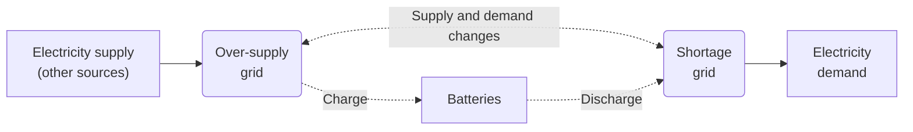
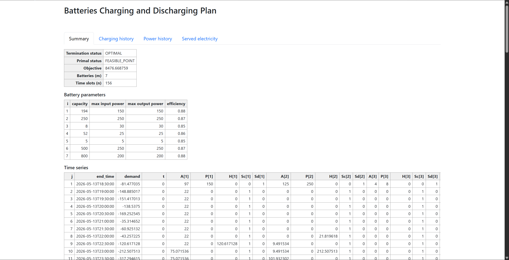
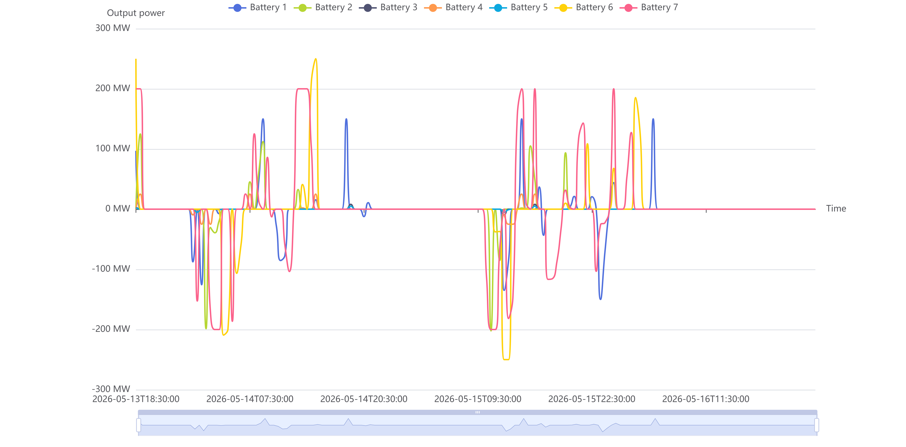
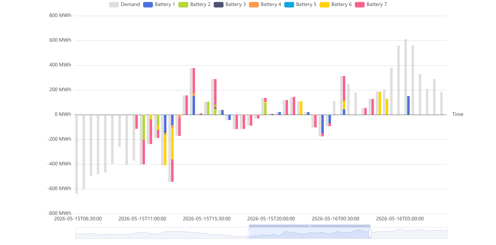

# Battery charging
 Battery charging and discharging planning


## Install

Create and activate a Julia environment.

## Model definition

This project formulates battery charging and discharging as a mixed-integer linear programming (MILP) problem. Given an electricity market with known demand and known generation from non-battery sources over a planning horizon, a group of batteries is scheduled to charge when the market is in over-supply and to discharge when the market is in shortage. Other generation (such as renewable power generation) sources first meet the demand directly; any surplus is routed to the over-supply grid, where batteries may charge from it. When generation falls short, batteries discharge into the shortage grid to help serve the remaining demand. The objective is to minimize the total unserved electricity demand across the horizon.



### Constants

We have $m$ batteries and intend to serve the electricity market in a time period of $n$ hours.

The electricity demand in each time slot (per hour) is known. Besides the batteries, other sources of power generation in each time slot are known as well. The demand minus all other sources' supply is the amount we need to serve. Denote this amount as $D_{j}, j = 1, ..., n$.

For each battery $i$, we use several arrays of size $1 \times n$ to denote its attributes:

-   The maximum electricity capacity of each battery is $C_{i}$.
-   The charging efficiency is $E_{i}$, the ratio of the amount of electricity added into the battery over the amount of charged electricity.
-   The maximum charging power is $I_{i}$.
-   The maximum discharging power is $O_{i}$.

### Variables

By default, all the variables are non-negative.

Let $t_{j}, \forall j = 1, ..., n$ be unserved amount of electricity in each time slot $j$.

Let $P_{ij}, \forall i = 1, ..., m, \forall j =  1, ..., n$ be discharged amount of electricity of each battery $i$ and each time slot $j$.

Let $H_{ij}, \forall i = 1, ..., m, \forall j =  1, ..., n$ be charged amount of electricity of each battery $i$ and each time slot $j$.

Let $S_{ij}^{c}, \forall i = 1, ..., m, \forall j =  1, ..., n$ be a binary variable to state whether battery $i$ is charging at time slot $j$.

Let $S_{ij}^{d}, \forall i = 1, ..., m, \forall j =  1, ..., n$ be a binary variable to state whether battery $i$ is discharging at time slot $j$.

Let $A_{ij}, \forall i = 1, ..., m, \forall j =  1, ..., n+1$ be the amount of electricity remained in each battery $i$ at the beginning of each time slot $j$.

### The objective function

We penalize the total amount of unserved electricity.

$$
\min{\sum_{j = 1}^{n}t_{j}}
$$

### Constraints

The unserved electricity is lower bounded by the gap between discharging amount and demand. Over-generation is not penalized.

$$
D_{j} - \sum_{i = 1}^{m}P_{ij} \leq t_{j}, \quad \forall j = 1, ..., n
$$

The charging deducts the discharging amount is equal to the difference of remained electricity in the battery between the current and the previous hour.

$$
A_{ij} + E_{i}H_{ij} - P_{ij} = A_{i,j + 1}, \quad \forall i = 1, ..., m, \quad j = 1, ..., n
$$

Specifically, $A_{i,1}, \forall i = 1, ..., m$ is assigned the initial amount of electricity in the battery.

If the battery is not in the charging status, the amount of charging must be 0. If the battery is in the charging status, the amount can be as large as the maximum charging power.

$$
H_{ij} \leq I_{i}S_{ij}^{c}, \quad \forall i = 1, ..., m, \quad j = 1, ..., n
$$

A similar constraint is applied to discharging.

$$
P_{ij} \leq O_{i}S_{ij}^{d}, \quad \forall i = 1, ..., m, \quad j = 1, ..., n
$$

The battery cannot charge and discharge at the same time.

$$
S_{ij}^{c} + S_{ij}^{d} \leq 1, \quad \forall i = 1, ..., m, \quad j = 1, ..., n
$$

If the battery is fully charged, it cannot charge.

$$
A_{ij} \leq C_{i}, \quad \forall i = 1, ..., m, \quad j = 1, ..., n
$$

Similarly, if the battery is empty, it cannot discharge.

$$
P_{ij} \leq A_{ij}, \quad \forall i = 1, ..., m, \quad j = 1, ..., n
$$

If the electricity produced by other sources cannot fulfill the demand, all batteries cannot charge.

$$
\sum_{i = 1}^{m}H_{ij} \leq \max\left( 0, -D_{j} \right), \quad \forall j = 1, ..., n
$$

## Get data

### Format

The command above is only a convenience wrapper around AEMO's South Australian data. The solver does not depend on AEMO at all: it simply reads a [JLD2](https://github.com/JuliaIO/JLD2.jl) file. If you have your own market data, you can skip the scripts under `aemo/` and write the `.jld2` file directly.

A dataset file stores the following keys (variables).

| Key          | Julia type  | Required? | Description                                                                        |
| ------------ | ----------- | --------- | ---------------------------------------------------------------------------------- |
| `batteries`  | `DataFrame` | Yes       | One row per battery. See the column layout below.                                  |
| `load`       | `DataFrame` | Yes       | One row per time slot. Column 1 is the slot end time; column 2 is demand; columns 3+ are non-battery supplies. See below. |
| `region`     | `String`    | No        | Free-form label for the market/region. Metadata only.                              |
| `start_time` | `String`    | No        | Series start, for reference. Metadata only.                                        |
| `end_time`   | `String`    | No        | Series end, for reference. Metadata only.                                          |

Only `batteries` and `load` are read by `solve.jl`; the remaining keys are metadata and may be omitted.

Data frame `batteries` has one row per battery ($m$ rows) with these columns (matching the model parameters above):

| Column       | Julia type | Unit           | Model symbol | Description                                                      |
| ------------ | ---------- | -------------- | ------------ | ---------------------------------------------------------------- |
| `capacity`   | `Float64`  | MWh            | $C_i$        | Energy capacity, `> 0`.                                          |
| `level`      | `Float64`  | fraction `0..1`| —            | Initial state of charge; the initial energy is `level * capacity`. |
| `c_power`    | `Float64`  | MW             | $I_i$        | Maximum charging power, `> 0`.                                   |
| `d_power`    | `Float64`  | MW             | $O_i$        | Maximum discharging power, `> 0`.                                |
| `efficiency` | `Float64`  | fraction `0..1`| $E_i$        | Charging efficiency.                                            |

Data frame `load` has one row per time slot ($n$ rows). Column order matters; column names are free-form and are not hard-coded:

| Position                 | Julia type | Description                                                  |
| ------------------------ | ---------- | ------------------------------------------------------------ |
| Column 1                 | `DateTime` | End time of each slot. Sampling must be uniform (a constant step between consecutive rows). |
| Column 2                 | `Float64`  | Electricity demand power in the slot.                        |
| Columns 3 and subsequent | `Float64`  | Non-battery supply power (one column per source). Optional; use zero columns for none. |

The net demand the batteries must serve is `demand - sum(supplies)`, i.e. $D_j$ in the model. The solver infers the slot duration $\Delta t$ (in hours) from the spacing of column 1, so make sure the time steps are uniform.

A minimal example that builds a dataset from your own arrays:

```julia
using DataFrames, Dates, JLD2

batteries = DataFrame(
    capacity   = [194.0, 250.0],
    level      = [0.5, 0.5],
    c_power    = [150.0, 250.0],
    d_power    = [150.0, 250.0],
    efficiency = [0.88, 0.87],
)

start = DateTime(2026, 1, 1, 0, 0, 0)
load = DataFrame(
    end_time = collect(start:Minute(30):start + Minute(30) * 47),  # 48 half-hourly slots
    demand   = rand(48) .* 1000,   # column 2: demand [MW]
    wind     = rand(48) .* 400,    # column 3+: supplies [MW]
    solar    = rand(48) .* 300,
)

jldopen("my_dataset.jld2", "w") do file
    file["batteries"] = batteries
    file["load"]      = load
end
```

### Source: AEMO

The Australian Energy Market Operator (AEMO) runs the National Electricity Market (NEM), which links the eastern and southern states of Australia through a shared high-voltage transmission grid. AEMO dispatches generators every 5 minutes to match demand at the lowest offered price, and publishes the resulting data, e.g. regional demand, per-unit SCADA generation, and next-day actual generation (non-scheduled dispatchable units).

South Australia is a useful slice of this data, because the region has a high share of wind and rooftop solar, a small number of large grid-scale batteries (such as the Honesdale Power Reserve, Torrens Island BESS, and Lake Bonney BESS), and a handful of gas-fired stations as backup. Each battery appears in AEMO data as one or more dispatchable units (DUIDs) with registered charge or discharge capacity and a storage size in MWh, which map directly onto the model parameters $C_i$, $I_i$, and $O_i$ above. Regional demand minus non-battery generation gives the $D_j$ series this project optimizes against.

The scripts under `aemo/` fetch these feeds and load them into a local SQLite database, so the MILP can be solved on a realistic, recent slice of the South Australian grid.

To collect the data, run the following command in terminal.

```
julia aemo/fetch_aemo_dispatched_scada.jl
julia aemo/fetch_aemo_du_detail_summary.jl
julia aemo/fetch_aemo_hist_demand.jl
julia aemo/fetch_aemo_next_day_gen.jl
```

Check the data integrity by run the following command in terminal.

```
julia aemo/south_australia_check_integrity.jl
```

The terminal will output whether the data has missing value and what is the missed time range. Rerun the corresponding script or manually input data into the database to fill missing data. The data integrity check doesn't have a compulsory passing condition, because the program will fill missing values by statistical methods, instead of breaking down.

>   [!note]
>
>   At the moment, re-running `aemo/fetch_aemo_dispatched_scada.jl` will check existed data in database and fetch new data incrementally. Other scripts can only fetch all the data and update the whole table.

To create a dataset, run the following command with arguments. It reads batteries from `aemo/batteries.txt` and electricity load from `aemo/south_australia.db`.

| Variable        | Data type | Required? | Description                                                  |
| --------------- | --------- | --------- | ------------------------------------------------------------ |
| `--start_time`  | String    | Yes       | Series start (exclusive), UTC `YYYY-MM-DD HH:MM:SS`.         |
| `--end_time`    | String    | Yes       | Series end (inclusive), UTC `YYYY-MM-DD HH:MM:SS`.           |
| `--output_path` | String    | Yes       | Path to write the dataset (`.jld2`).                         |
| `--region`      | String    | Yes       | NEM region id (e.g. South Australia `SA1`).                  |
| `--db_path`     | String    | No        | Path to the SQLite database. Defaults to `aemo/south_australia.db`. |

### 

## Solve

Let the saved dataset file path be `$dataset`.

Assume the file path to save the solution in format of JLD2 is `$solution`; the file path to save the visualization report in format of HTML is `$report` (all can be customized).

To solve the problem and generate the report, run the following command in terminal.

```
julia solve.jl --input_path $dataset --output_path $solution
julia visualization.jl --input_path $solution --output_path $report
```

`solve.jl` has additional arguments:

| Variable    | Data type | Required? | Description                                                  |
| ----------- | --------- | --------- | ------------------------------------------------------------ |
| `--timeout` | Float64   | No        | Maximum time for the solver to solve the optimization problem, in unit of seconds. |

## Results

After solving the model, an HTML report is saved at `$report`.

The report includes the following tabs.

### Summary

Status and value of objective function and variables.



### Charging history

Charging and discharging history of each battery. Read segment means discharging; green segment means charging; gray segment means neither charging nor discharging.

The maximum value of Y-axis always the energy capacity of battery.

The X-axis value means the end time of each slot. (The same across all time series plots.)


### Power history

The power of inputting or outputting electricity of each battery.

The positive part of Y-axis is output (discharging) power, and the negative part is input (charging) power.



### Served electricity

The gray bar is the amount of electricity demand. The positive value means other supply resources cannot fulfill the demand of the electricity market; the negative value means redundant electricity is available in the electricity market and batteries owner can use these energy to charge batteries. The stacked bars of batteries are the amount of energy taken or served in each period. 

The following table explains how to compare the height of bars.

| Stacked height of battery bars \_\_\_\_\_\_ the height (absolute value in either direction) of gray bar | Positive gray bar                             | Negative gray bar                              |
| ------------------------------------------------------------ | --------------------------------------------- | ---------------------------------------------- |
| equal to                                                     | All additional demand are served by batteries | All redundant supply are recycled by batteries |
| is shorter than                                              | Outage                                        | Grid waste redundant energy                    |
| is longer than                                               | Batteries waste redundant energy              | (Infeasible)                                   |


